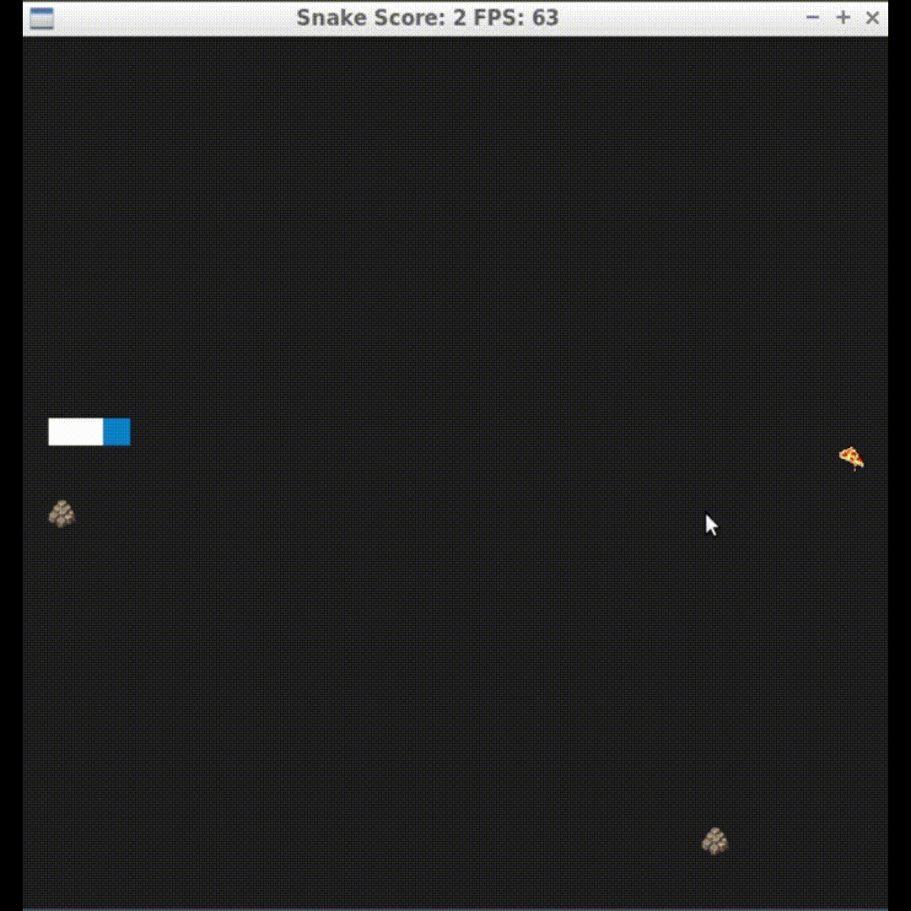

# CPPND: Capstone Snake Game Example

This is a starter repo for the Capstone project in the [Udacity C++ Nanodegree Program](https://www.udacity.com/course/c-plus-plus-nanodegree--nd213). The code for this repo was inspired by [this](https://codereview.stackexchange.com/questions/212296/snake-game-in-c-with-sdl) excellent StackOverflow post and set of responses.

The Capstone Project gives you a chance to integrate what you've learned throughout this program. This project will become an important part of your portfolio to share with current and future colleagues and employers.

In this project, you can build your own C++ application or extend this Snake game, following the principles you have learned throughout this Nanodegree Program. This project will demonstrate that you can independently create applications using a wide range of C++ features.

## Dependencies for Running Locally
* cmake >= 3.7
  * All OSes: [click here for installation instructions](https://cmake.org/install/)
* make >= 4.1 (Linux, Mac), 3.81 (Windows)
  * Linux: make is installed by default on most Linux distros
  * Mac: [install Xcode command line tools to get make](https://developer.apple.com/xcode/features/)
  * Windows: [Click here for installation instructions](http://gnuwin32.sourceforge.net/packages/make.htm)
* SDL2 >= 2.0
  * All installation instructions can be found [here](https://wiki.libsdl.org/Installation)
  >Note that for Linux, an `apt` or `apt-get` installation is preferred to building from source.
* SDL2_Image >= 2.0
  * All installation instructions can be found [here](https://github.com/libsdl-org/SDL_image)
  >I used the following command to install this library `apt install libsdl2-image-dev`
* gcc/g++ >= 5.4
  * Linux: gcc / g++ is installed by default on most Linux distros
  * Mac: same deal as make - [install Xcode command line tools](https://developer.apple.com/xcode/features/)
  * Windows: recommend using [MinGW](http://www.mingw.org/)

## Basic Build Instructions

1. Clone this repo.
2. Make a build directory in the top level directory: `mkdir build && cd build`
3. Compile: `cmake .. && make`
4. Run it: `./SnakeGame`.

## New features

- Added a new feature which adds moving obstacles to the game. When the snake head hits one of the moving obstacles the game is over
- Added an input for the players name
- The score is saved into a txt file after every game
- The high score is displayed at the end of every game

## Rubic points addressed

### Compiling and Testing

The repository has been cloned into the workspace environment and has been compiled there. The code runs without issues

### Loops, Functions, I/O

- Demonstrated knowledge about functions and control structures by restructuring render function of Renderer object
- Added score keeping function in game.cpp which reads and writes to files
- Added player name as input in game.cpp

### Object Oriented Programming

- Added obstacle class
- Used initializer list in normal class constructor of obstacle class
- Overloaded the constructor of the obstacle class to create a copy constructor

### Memory Management

- Used references in multiple instances like for example in the renderer class for rendering the snake or the food
- Implemented the rule of 5 in the obstacle class. Default constructor was chosen because no memory needs to be de-allocated
- Used a list of unique_ptrs to store the obstacles in the game class

### Concurrency

- The project uses concurrency in the game class
- A timer is implemented as a thread which triggers the re-generation of the obstacles every 15 s